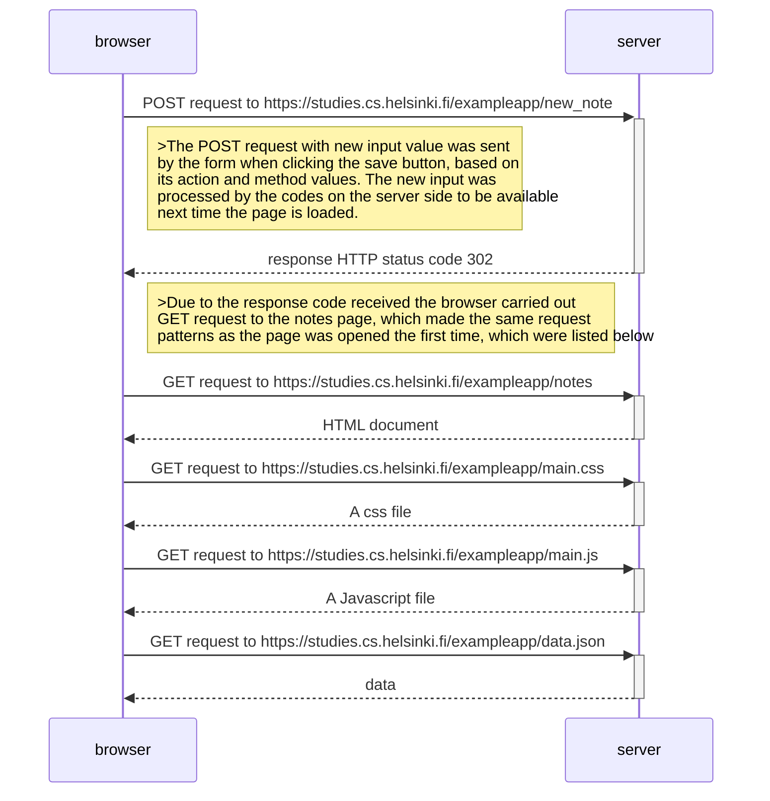

# New note diagram

```mermaid
sequenceDiagram
  %%{init: { 'sequence': {'noteAlign': 'left'} }}%%

  participant b as browser
  participant s as server

  b->>+s: POST request to https://studies.cs.helsinki.fi/exampleapp/new_note 
  note right of b: >The POST request with new input value was sent<br/> by the form when clicking the save button, based on<br/>its action and method values. The new input was<br/> processed by the codes on the server side to be available<br/>next time the page is loaded.

  s-->>-b: response HTTP status code 302

  note right of b: >Due to the response code received the browser carried out<br/>GET request to the notes page, which made the same request<br/>patterns as the page was opened the first time, which were listed below      

  b->>+s: GET request to https://studies.cs.helsinki.fi/exampleapp/notes
  s-->>-b: HTML document

  b->>+s: GET request to https://studies.cs.helsinki.fi/exampleapp/main.css
  s-->>-b: A css file

  b->>+s: GET request to https://studies.cs.helsinki.fi/exampleapp/main.js
  s-->>-b: A Javascript file

  b->>+s: GET request to https://studies.cs.helsinki.fi/exampleapp/data.json
  s-->>-b: data
```