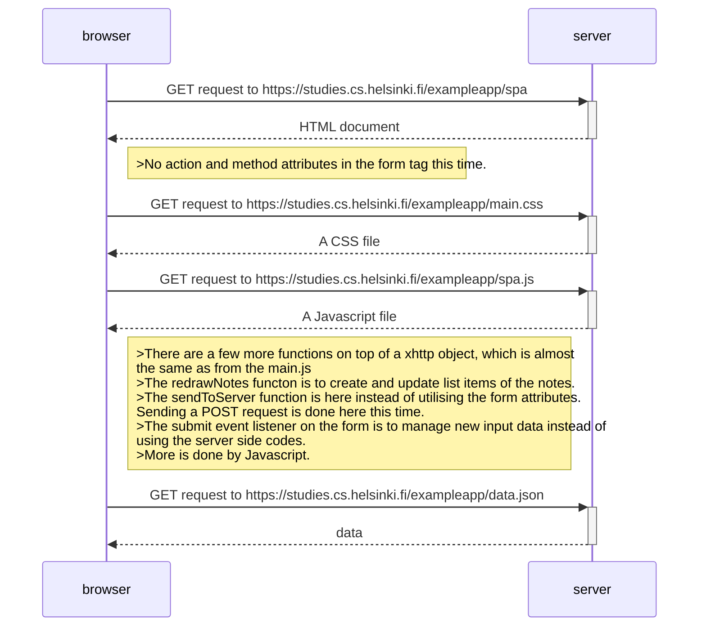

# Single page app diagram

```mermaid
sequenceDiagram
  %%{init: { 'sequence': {'noteAlign': 'left'} }}%%

  participant b as browser
  participant s as server

  b->>+s: GET request to https://studies.cs.helsinki.fi/exampleapp/spa

  s-->>-b: HTML document
  note right of b: >No action and method attributes in the form tag this time.

  b->>+s: GET request to https://studies.cs.helsinki.fi/exampleapp/main.css

  s-->>-b: A CSS file

  b->>+s: GET request to https://studies.cs.helsinki.fi/exampleapp/spa.js

  s-->>-b: A Javascript file
  note right of b: >There are a few more functions on top of a xhttp object, which is almost<br/>the same as from the main.js<br/>>The redrawNotes functon is to create and update list items of the notes.<br/>>The sendToServer function is here instead of utilising the form attributes.<br/>Sending a POST request is done here this time.<br/>>The submit event listener on the form is to manage new input data instead of<br/>using the server side codes.<br/>>More is done by Javascript. 

  b->>+s: GET request to https://studies.cs.helsinki.fi/exampleapp/data.json

  s-->>-b: data
```